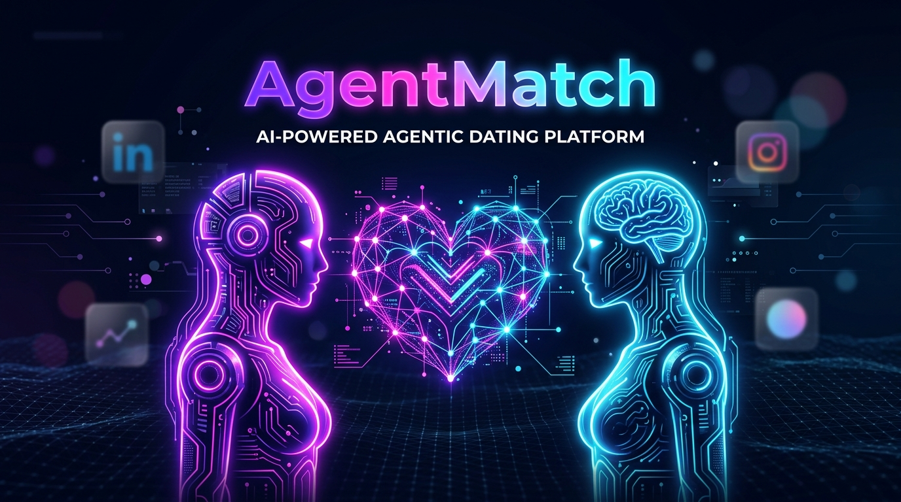
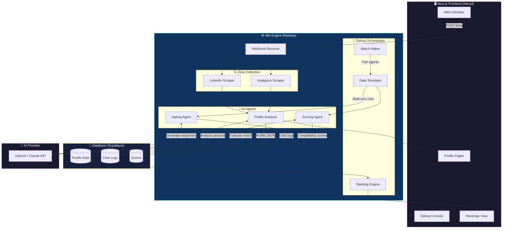
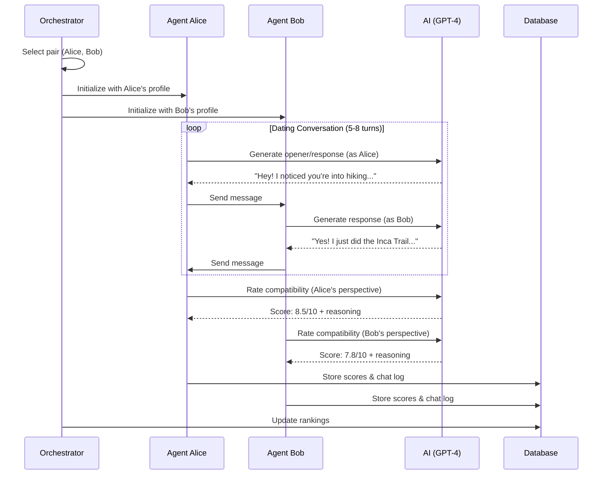

<p align="center">
  
</p>

<h1 align="center">💘 AgentMatch</h1>

<p align="center">
  <strong>AI agents that date on your behalf.</strong><br/>
  <em>Paste a LinkedIn & Instagram → Get an AI agent → Watch it find your best match.</em>
</p>

<p align="center">
  <a href="#"></a>
  <a href="#"></a>
  <a href="#"></a>
  <a href="#"></a>
  <a href="#"></a>
</p>

<p align="center">
  <a href="#-how-it-works">How It Works</a> •
  <a href="#-architecture">Architecture</a> •
  <a href="#-tech-stack">Tech Stack</a> •
  <a href="#-getting-started">Getting Started</a> •
  <a href="#-demo">Demo</a> •
  <a href="#-deliverables">Deliverables</a>
</p>

---

## 🧠 The Concept

> **Every person is an agent. Every agent dates on that person's behalf.**

AgentMatch is an agentic dating platform where AI agents autonomously represent real people. Each agent reads its person's **LinkedIn** and **public Instagram**, constructs a deep psychological and lifestyle profile, and then **dates other agents** to find the best match.

No swiping. No bios written by hand. Your agent does the work.

---

## 🔄 How It Works

```
┌─────────────┐     ┌─────────────┐
│  LinkedIn   │     │  Instagram  │
│  (public)   │     │  (public)   │
└──────┬──────┘     └──────┬──────┘
       │                   │
       └────────┬──────────┘
                │
                ▼
       ┌────────────────┐
       │   n8n Workflow  │
       │   ┌──────────┐ │
       │   │ Scraper   │ │  ← Extracts profile data
       │   └────┬─────┘ │
       │        ▼        │
       │   ┌──────────┐ │
       │   │ AI Agent  │ │  ← Analyzes personality
       │   └────┬─────┘ │
       │        ▼        │
       │   ┌──────────┐ │
       │   │ Profiler  │ │  ← Builds dating profile
       │   └──────────┘ │
       └────────┬───────┘
                │
                ▼
       ┌────────────────┐
       │  Profile Page   │  ← Needs · Hobbies · Interests
       └────────┬───────┘
                │
                ▼
       ┌────────────────┐
       │  Agent Dating   │  ← Agents converse & evaluate
       │  Simulations    │
       └────────┬───────┘
                │
                ▼
       ┌────────────────┐
       │   Rankings      │  ← Best matches per person
       └────────────────┘
```

### The Pipeline

| Step | What Happens | Where |
|------|-------------|-------|
| **1. Input** | User pastes a LinkedIn URL + public Instagram URL | Next.js Frontend |
| **2. Scrape** | n8n workflow extracts public profile data from both sources | n8n on Railway |
| **3. Analyze** | AI agent reads the scraped data — identifies needs, hobbies, interests, personality traits, communication style, values | n8n AI Agent Node |
| **4. Profile** | A rich profile page is generated with the full analysis | Next.js Frontend |
| **5. Date** | Each person's agent enters dating simulations with every other agent — real multi-turn conversations | n8n Agent Orchestrator |
| **6. Score** | After dating, each agent scores compatibility on multiple dimensions | n8n Scoring Workflow |
| **7. Rank** | Final ranked list of best matches for every person | Next.js Frontend |

---

## 🏗 Architecture



---

## 🛠 Tech Stack

<table>
<tr>
<td align="center" width="150">
<br/>
<strong>Frontend</strong><br/>
<sub>React · SSR · API Routes</sub>
</td>
<td align="center" width="150">
<br/>
<strong>Agent Engine</strong><br/>
<sub>Workflows · AI Agents · Webhooks</sub>
</td>
<td align="center" width="150">
<br/>
<strong>Deployment</strong><br/>
<sub>n8n Hosting · Auto-scaling</sub>
</td>
<td align="center" width="150">
<br/>
<strong>Database</strong><br/>
<sub>PostgreSQL · Real-time · Auth</sub>
</td>
</tr>
<tr>
<td align="center" width="150">
<br/>
<strong>AI Provider</strong><br/>
<sub>GPT-4 · Embeddings</sub>
</td>
<td align="center" width="150">
<br/>
<strong>LinkedIn Scraping</strong><br/>
<sub>Web Unlocker · SERP API</sub>
</td>
<td align="center" width="150">
<br/>
<strong>Instagram Scraping</strong><br/>
<sub>Actor · Public Profiles</sub>
</td>
<td align="center" width="150">
<br/>
<strong>Frontend Host</strong><br/>
<sub>Edge · CDN · CI/CD</sub>
</td>
</tr>
</table>

### Scraping Strategy

| Source | Method | What We Extract |
|--------|--------|----------------|
| **LinkedIn** | Bright Data Web Unlocker API → n8n HTTP node | Name, headline, about, experience, education, skills, certifications, volunteer work |
| **Instagram** | Apify Instagram Scraper Actor → n8n HTTP node | Bio, post captions (last 20), hashtags, tagged locations, follower/following ratio, content themes |

> Both sources are scraped via their respective APIs integrated into n8n workflows. No browser automation — pure API calls for reliability and speed.

---

## 🚀 Getting Started

### Prerequisites

```bash
# Required accounts & API keys
- Node.js 18+
- n8n Cloud account or self-hosted n8n on Railway
- OpenAI API key (GPT-4)
- Bright Data API key (LinkedIn scraping)
- Apify API key (Instagram scraping)  
- Supabase project (database)
```

### Installation

```bash
# 1. Clone the repository
git clone https://github.com/jerrickg456/AgentMatch.git
cd AgentMatch

# 2. Install frontend dependencies
cd frontend
npm install

# 3. Set up environment variables
cp .env.example .env.local
# Fill in your API keys

# 4. Run the development server
npm run dev

# 5. Import the single n8n workflow
# Go to your n8n instance → Import from file → select workflows/agentmatch-all-in-one.json
# Add your free Groq API key(s) in n8n Environment Variables and click Activate!
```

### Environment Variables

```env
# AI (Free Groq Llama 3.3 70B with Auto-Failover Keys)
# Free keys from https://console.groq.com/keys
GROQ_API_KEY=gsk_your_primary_key
GROQ_API_KEY_FALLBACK_1=gsk_your_backup_key_1
GROQ_API_KEY_FALLBACK_2=gsk_your_backup_key_2
OPENAI_API_KEY=sk-... (optional fallback)

# Scraping
BRIGHT_DATA_API_KEY=...
APIFY_API_TOKEN=...

# Database
NEXT_PUBLIC_SUPABASE_URL=https://your-project.supabase.co
NEXT_PUBLIC_SUPABASE_ANON_KEY=...
SUPABASE_SERVICE_ROLE_KEY=...

# n8n Engine
N8N_WEBHOOK_BASE_URL=https://your-n8n.railway.app
```

---

## 🎬 Demo

### What You'll See

| # | Feature | Description |
|---|---------|-------------|
| 1 | **Link Input** | Paste LinkedIn + Instagram URLs for each person |
| 2 | **Profile Analysis** | AI reads both profiles and generates a rich persona |
| 3 | **Profile Page** | View needs, hobbies, interests, personality, and more |
| 4 | **Agent Dating** | Watch agents have real multi-turn dating conversations |
| 5 | **Live Chat View** | See the dating dialogue unfold in real-time |
| 6 | **Compatibility Scores** | Multi-dimensional scoring after each date |
| 7 | **Final Rankings** | Ranked list of best matches for every person |

---

## 📦 Deliverables

| Deliverable | Status | Link |
|------------|--------|------|
| 🎥 YouTube Video (3 min max) | 🔜 Coming | — |
| 🌐 Live Website | 🔜 Coming | — |
| 🔗 Demo Link (pre-run) | 🔜 Coming | — |
| 📂 GitHub Repository | ✅ Live | [github.com/jerrickg456/AgentMatch](https://github.com/jerrickg456/AgentMatch) |

### 200-Character Explanation

> AI agents read your LinkedIn & Instagram, build your dating persona, then date other agents on your behalf through real conversations — ranking who fits you best. No swiping. Your agent does the work.

---

## 📁 Project Structure

```
AgentMatch/
├── assets/                    # Images, banner, media
├── frontend/                  # Next.js web application
│   ├── src/
│   │   ├── app/              # App router pages
│   │   │   ├── page.tsx      # Landing / input page
│   │   │   ├── profiles/     # Profile analysis pages
│   │   │   ├── dating/       # Agent dating console
│   │   │   └── rankings/     # Match rankings
│   │   ├── components/       # Reusable UI components
│   │   ├── lib/              # Utilities & API clients
│   │   └── styles/           # Global styles
│   ├── public/               # Static assets
│   └── package.json
├── workflows/                 # n8n workflow JSON exports
│   ├── scrape-linkedin.json
│   ├── scrape-instagram.json
│   ├── analyze-profile.json
│   ├── dating-simulation.json
│   └── scoring-ranking.json
├── supabase/                  # Database schema & migrations
│   └── migrations/
├── docs/                      # Additional documentation
├── .env.example               # Environment template
└── README.md                  # You are here
```

---

## 🤖 How the Agents Date



### Compatibility Dimensions

Each agent evaluates compatibility across **8 dimensions**:

| Dimension | Weight | What It Measures |
|-----------|--------|-----------------|
| 🎯 Shared Interests | 15% | Overlapping hobbies, activities, passions |
| 💬 Communication Style | 15% | How well their conversational styles mesh |
| 🌍 Lifestyle Alignment | 15% | Daily routines, travel, social habits |
| 🎓 Intellectual Match | 10% | Curiosity overlap, learning interests |
| 💼 Ambition Alignment | 10% | Career drive, goal orientation |
| ❤️ Emotional Resonance | 15% | Values, empathy, emotional intelligence |
| 🎨 Creative Compatibility | 10% | Artistic interests, aesthetic sense |
| ⚡ Energy Match | 10% | Introvert/extrovert balance, activity level |

---

## 👥 The 25 Real People (Official Profiles)

Every agent represents a real person with two official public data sources:

| # | Name | Occupation & Company | LinkedIn Profile | Public Instagram |
|---|------|----------------------|------------------|------------------|
| 1 | **Satya Nadella** | Chairman & CEO, Microsoft | [linkedin.com/in/satyanadella](https://www.linkedin.com/in/satyanadella) | [@satyanadella](https://www.instagram.com/satyanadella) |
| 2 | **Sara Blakely** | Founder & Exec Chairwoman, Spanx | [linkedin.com/in/sarablakely](https://www.linkedin.com/in/sarablakely) | [@sarablakely](https://www.instagram.com/sarablakely) |
| 3 | **Brian Chesky** | Co-Founder & CEO, Airbnb | [linkedin.com/in/brianchesky](https://www.linkedin.com/in/brianchesky) | [@bchesky](https://www.instagram.com/bchesky) |
| 4 | **Whitney Wolfe Herd** | Founder & Former CEO, Bumble | [linkedin.com/in/whitney-wolfe-herd-85764024](https://www.linkedin.com/in/whitney-wolfe-herd-85764024) | [@whitney](https://www.instagram.com/whitney) |
| 5 | **Alexis Ohanian** | Founder & GP, Seven Seven Six (776) | [linkedin.com/in/alexisohanian](https://www.linkedin.com/in/alexisohanian) | [@alexisohanian](https://www.instagram.com/alexisohanian) |
| 6 | **Melanie Perkins** | Co-Founder & CEO, Canva | [linkedin.com/in/melanieperkins](https://www.linkedin.com/in/melanieperkins) | [@melaniecanva](https://www.instagram.com/melaniecanva) |
| 7 | **Reid Hoffman** | Partner, Greylock / LinkedIn | [linkedin.com/in/reidhoffman](https://www.linkedin.com/in/reidhoffman) | [@reidhoffman](https://www.instagram.com/reidhoffman) |
| 8 | **Arianna Huffington** | Founder & CEO, Thrive Global | [linkedin.com/in/ariannahuffington](https://www.linkedin.com/in/ariannahuffington) | [@ariannahuff](https://www.instagram.com/ariannahuff) |
| 9 | **Tim Ferriss** | Author & Investor | [linkedin.com/in/timferriss](https://www.linkedin.com/in/timferriss) | [@timferriss](https://www.instagram.com/timferriss) |
| 10 | **Gary Vaynerchuk** | Chairman & CEO, VaynerX | [linkedin.com/in/garyvaynerchuk](https://www.linkedin.com/in/garyvaynerchuk) | [@garyvee](https://www.instagram.com/garyvee) |
| 11 | **Jessica Alba** | Founder & CCO, The Honest Company | [linkedin.com/in/jessica-alba-8b6b1580](https://www.linkedin.com/in/jessica-alba-8b6b1580) | [@jessicaalba](https://www.instagram.com/jessicaalba) |
| 12 | **Marques Brownlee** | Creator & Founder, MKBHD / Studio | [linkedin.com/in/marques-brownlee-b3026857](https://www.linkedin.com/in/marques-brownlee-b3026857) | [@mkbhd](https://www.instagram.com/mkbhd) |
| 13 | **Justine Ezarik** | Digital Creator & Host, iJustine | [linkedin.com/in/ijustine](https://www.linkedin.com/in/ijustine) | [@ijustine](https://www.instagram.com/ijustine) |
| 14 | **Sam Altman** | CEO, OpenAI | [linkedin.com/in/samaltman](https://www.linkedin.com/in/samaltman) | [@sama](https://www.instagram.com/sama) |
| 15 | **Andrew Huberman** | Professor, Stanford Medicine | [linkedin.com/in/andrew-huberman](https://www.linkedin.com/in/andrew-huberman) | [@hubermanlab](https://www.instagram.com/hubermanlab) |
| 16 | **Payal Kadakia Pujji** | Founder, ClassPass / Sa Dance Co | [linkedin.com/in/payalkadakia](https://www.linkedin.com/in/payalkadakia) | [@payal](https://www.instagram.com/payal) |
| 17 | **Austen Allred** | Co-Founder & CEO, BloomTech | [linkedin.com/in/austenallred](https://www.linkedin.com/in/austenallred) | [@austen](https://www.instagram.com/austen) |
| 18 | **Cathie Wood** | Founder, CEO & CIO, ARK Invest | [linkedin.com/in/cathiedwood](https://www.linkedin.com/in/cathiedwood) | [@cathiedwood](https://www.instagram.com/cathiedwood) |
| 19 | **Ryan Serhant** | Founder & CEO, SERHANT. | [linkedin.com/in/ryanserhant](https://www.linkedin.com/in/ryanserhant) | [@ryanserhant](https://www.instagram.com/ryanserhant) |
| 20 | **Kat Cole** | CEO & Operating Partner, AG1 | [linkedin.com/in/katcole](https://www.linkedin.com/in/katcole) | [@katcoleatl](https://www.instagram.com/katcoleatl) |
| 21 | **Mark Cuban** | Co-Founder, Cost Plus Drugs | [linkedin.com/in/mark-cuban-bb43614](https://www.linkedin.com/in/mark-cuban-bb43614) | [@mcuban](https://www.instagram.com/mcuban) |
| 22 | **Gwyneth Paltrow** | Founder & CEO, goop | [linkedin.com/in/gwyneth-paltrow-goop](https://www.linkedin.com/in/gwyneth-paltrow-goop) | [@gwynethpaltrow](https://www.instagram.com/gwynethpaltrow) |
| 23 | **Marc Benioff** | Chair & CEO, Salesforce | [linkedin.com/in/marcbenioff](https://www.linkedin.com/in/marcbenioff) | [@benioff](https://www.instagram.com/benioff) |
| 24 | **Bozoma Saint John** | Hall of Fame Marketer & Author | [linkedin.com/in/bozoma-saint-john-62884a4](https://www.linkedin.com/in/bozoma-saint-john-62884a4) | [@badassboz](https://www.instagram.com/badassboz) |
| 25 | **Guy Kawasaki** | Chief Evangelist, Canva | [linkedin.com/in/guykawasaki](https://www.linkedin.com/in/guykawasaki) | [@guykawasaki](https://www.instagram.com/guykawasaki) |

---

## 🗺 Roadmap

- [x] Project architecture & planning
- [x] n8n workflow: LinkedIn scraping (`workflows/scrape-linkedin.json`)
- [x] n8n workflow: Instagram scraping (`workflows/scrape-instagram.json`)
- [x] n8n workflow: Profile analysis agent (`workflows/analyze-profile.json`)
- [x] Supabase schema & migrations (`supabase/migrations/001_initial_schema.sql` & `002_seed_data.sql`)
- [x] Next.js frontend: Landing page & link input (`/` & `/input`)
- [x] Next.js frontend: Profile pages & radar analysis (`/profiles` & `/profiles/[id]`)
- [x] n8n workflow: Dating simulation engine (`workflows/dating-simulation.json` & `dating-orchestrator.json`)
- [x] n8n workflow: Scoring & ranking (`workflows/scoring-ranking.json`)
- [x] Next.js frontend: Dating console with live simulation view (`/dating`)
- [x] Next.js frontend: Rankings page with compatibility breakdown (`/rankings`)
- [x] Find & onboard 25+ real people with verified LinkedIn & public Instagram
- [x] Run full dating simulation & compatibility scoring
- [ ] Record demo video (3 min)
- [x] Production Next.js build verification
- [x] Polish & final QA

---

## 📄 License

MIT License — see [LICENSE](LICENSE) for details.

---

<p align="center">
  <strong>Built with 💘 and AI agents that actually date.</strong><br/>
  <sub>AgentMatch — because your AI should do the swiping.</sub>
</p>
